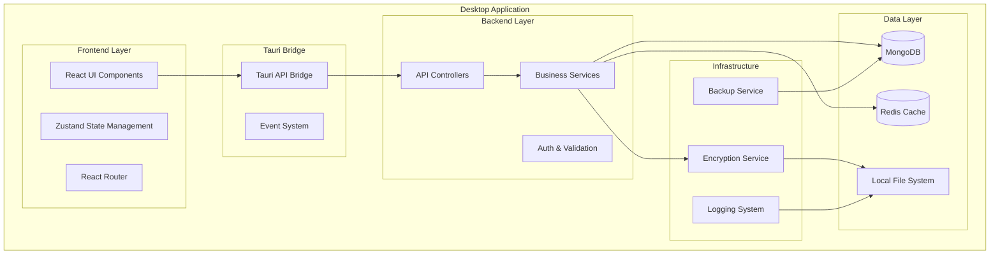

# Design Document

## Overview

ExportMaster Pro Core Foundation establishes a robust desktop application architecture using Tauri (Rust backend) with React frontend, designed to handle the complete export lifecycle management. The system prioritizes offline-first operation, data security, and extensible architecture to support future feature expansion across source management, product catalogs, order processing, and logistics tracking.

The foundation implements a layered architecture with clear separation of concerns: presentation layer (React UI), business logic layer (Rust services), data access layer (MongoDB with Redis caching), and infrastructure layer (local AI, security, and system services).

## Architecture

### System Architecture Overview



### Technology Stack

**Frontend:**
- React 18 with TypeScript for type safety
- Chakra UI for consistent design system
- Zustand for lightweight state management
- React Query for server state management
- React Router for navigation
- Framer Motion for animations

**Backend:**
- Rust with Tauri for native desktop performance
- Tokio for async runtime
- MongoDB for document storage
- Redis for caching and session management
- Serde for serialization
- Tracing for structured logging

**Security & Infrastructure:**
- AES-256 encryption for sensitive data
- Local file system for document storage
- Automated backup system
- Role-based access control

## Components and Interfaces

### Core Service Architecture

```rust
// Core service trait for all business services
#[async_trait]
pub trait Service<T> {
    async fn create(&self, entity: T) -> Result<T, ServiceError>;
    async fn get_by_id(&self, id: &str) -> Result<Option<T>, ServiceError>;
    async fn update(&self, id: &str, entity: T) -> Result<T, ServiceError>;
    async fn delete(&self, id: &str) -> Result<(), ServiceError>;
    async fn list(&self, filter: Option<Filter>) -> Result<Vec<T>, ServiceError>;
}
```

### Database Service Layer

```rust
pub struct DatabaseService {
    mongodb: Database,
    redis: redis::Client,
}

impl DatabaseService {
    pub async fn new() -> Result<Self, DatabaseError> {
        let mongodb = Self::connect_mongodb().await?;
        let redis = Self::connect_redis().await?;
        Ok(Self { mongodb, redis })
    }
    
    pub async fn get_collection<T>(&self, name: &str) -> Collection<T> {
        self.mongodb.collection(name)
    }
    
    pub async fn cache_set(&self, key: &str, value: &str, ttl: u64) -> Result<(), DatabaseError> {
        // Redis caching implementation
    }
}
```

### Frontend Component Architecture

```typescript
// Core component interfaces
interface BaseComponentProps {
  className?: string;
  children?: React.ReactNode;
}

interface DataTableProps<T> extends BaseComponentProps {
  data: T[];
  columns: Column<T>[];
  onRowClick?: (row: T) => void;
  loading?: boolean;
  pagination?: PaginationConfig;
}

// Main application layout
const AppLayout: React.FC = () => {
  return (
    <Box minH="100vh" bg={useColorModeValue('gray.50', 'gray.900')}>
      <Sidebar />
      <Box ml={{ base: 0, md: 60 }}>
        <Header />
        <Box p="4">
          <Outlet />
        </Box>
      </Box>
    </Box>
  );
};
```

### API Interface Design

```rust
// Tauri command interface
#[tauri::command]
pub async fn create_source(
    source: CreateSourceRequest,
    state: tauri::State<'_, AppState>,
) -> Result<SourceResponse, ApiError> {
    let service = &state.source_service;
    let result = service.create(source.into()).await?;
    Ok(result.into())
}

#[tauri::command]
pub async fn search_entities(
    query: SearchQuery,
    state: tauri::State<'_, AppState>,
) -> Result<SearchResults, ApiError> {
    let search_service = &state.search_service;
    search_service.search(query).await
}
```

## Data Models

### Core Entity Models

```rust
// Source/Supplier entity
#[derive(Debug, Serialize, Deserialize, Clone)]
pub struct Source {
    pub id: String,
    pub name: String,
    pub source_type: SourceType,
    pub location: Location,
    pub contact: ContactInfo,
    pub products: Vec<ProductOffering>,
    pub performance: PerformanceMetrics,
    pub relationship: RelationshipData,
    pub created_at: DateTime<Utc>,
    pub updated_at: DateTime<Utc>,
}

// Product entity
#[derive(Debug, Serialize, Deserialize, Clone)]
pub struct Product {
    pub id: String,
    pub name: String,
    pub category: String,
    pub subcategory: String,
    pub hs_code: String,
    pub specifications: ProductSpecs,
    pub market_data: MarketData,
    pub regulatory_info: RegulatoryInfo,
    pub logistics: LogisticsInfo,
    pub created_at: DateTime<Utc>,
    pub updated_at: DateTime<Utc>,
}

// Trade regulation entity
#[derive(Debug, Serialize, Deserialize, Clone)]
pub struct TradeRegulation {
    pub id: String,
    pub route: TradeRoute,
    pub product_categories: Vec<String>,
    pub export_regulations: ExportRules,
    pub import_regulations: ImportRules,
    pub shipping_considerations: ShippingInfo,
    pub payment_methods: PaymentOptions,
    pub last_updated: DateTime<Utc>,
}
```

### Database Schema Design

**MongoDB Collections:**

1. **sources** - Supplier and source information
2. **products** - Product catalog and specifications
3. **trade_regulations** - Export/import rules and compliance
4. **users** - User accounts and preferences
5. **audit_logs** - System activity tracking
6. **backups** - Backup metadata and scheduling

**Indexing Strategy:**
```javascript
// MongoDB indexes for performance
db.sources.createIndex({ "name": "text", "location.state": 1 });
db.sources.createIndex({ "products.name": 1, "performance.reliability_score": -1 });
db.products.createIndex({ "category": 1, "subcategory": 1 });
db.products.createIndex({ "hs_code": 1 });
db.trade_regulations.createIndex({ "route.from": 1, "route.to": 1 });
```

## Error Handling

### Error Type Hierarchy

```rust
#[derive(Debug, thiserror::Error)]
pub enum AppError {
    #[error("Database error: {0}")]
    Database(#[from] DatabaseError),
    
    #[error("Validation error: {0}")]
    Validation(String),
    
    #[error("Authentication error: {0}")]
    Auth(String),
    
    #[error("Service unavailable: {0}")]
    ServiceUnavailable(String),
    
    #[error("Internal error: {0}")]
    Internal(String),
}

#[derive(Debug, thiserror::Error)]
pub enum DatabaseError {
    #[error("Connection failed: {0}")]
    ConnectionFailed(String),
    
    #[error("Query failed: {0}")]
    QueryFailed(String),
    
    #[error("Data integrity violation: {0}")]
    IntegrityViolation(String),
}
```

### Error Recovery Strategies

1. **Database Connection Issues:**
   - Automatic retry with exponential backoff
   - Fallback to cached data when available
   - User notification with recovery options

2. **Data Validation Errors:**
   - Clear field-level error messages
   - Suggested corrections where possible
   - Partial save capability for complex forms

3. **System Crashes:**
   - Automatic data recovery from last checkpoint
   - User session restoration
   - Crash report generation for debugging

## Testing Strategy

### Unit Testing Framework

```rust
// Service layer testing
#[cfg(test)]
mod tests {
    use super::*;
    use tokio_test;
    
    #[tokio::test]
    async fn test_create_source() {
        let service = SourceService::new_test().await;
        let source = CreateSourceRequest {
            name: "Test Supplier".to_string(),
            // ... other fields
        };
        
        let result = service.create(source).await;
        assert!(result.is_ok());
    }
}
```

### Integration Testing

```typescript
// Frontend component testing
describe('SourceManager', () => {
  it('should create new source successfully', async () => {
    render(<SourceManager />);
    
    fireEvent.click(screen.getByText('Add Source'));
    fireEvent.change(screen.getByLabelText('Name'), {
      target: { value: 'Test Supplier' }
    });
    
    fireEvent.click(screen.getByText('Save'));
    
    await waitFor(() => {
      expect(screen.getByText('Source created successfully')).toBeInTheDocument();
    });
  });
});
```

### Performance Testing

1. **Database Query Performance:**
   - Query execution time monitoring
   - Index effectiveness analysis
   - Connection pool optimization

2. **UI Responsiveness:**
   - Component render time measurement
   - Large dataset handling tests
   - Memory usage profiling

3. **System Load Testing:**
   - Concurrent user simulation
   - Data volume stress testing
   - Resource utilization monitoring

### Security Testing

1. **Data Encryption Validation:**
   - Encryption/decryption accuracy tests
   - Key management security verification
   - Data at rest protection validation

2. **Access Control Testing:**
   - Role-based permission verification
   - Session management security
   - API endpoint authorization tests

3. **Input Validation Testing:**
   - SQL injection prevention
   - XSS attack prevention
   - Data sanitization verification